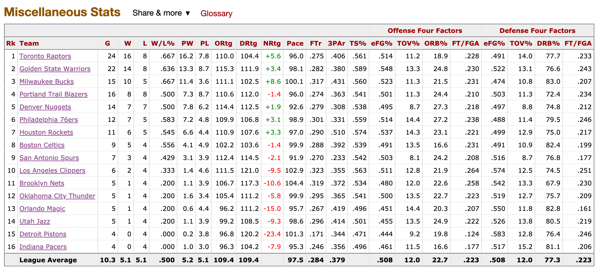
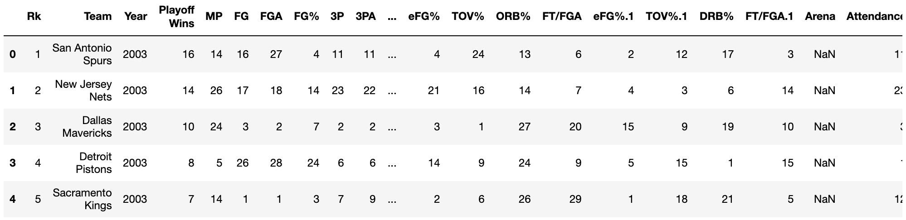
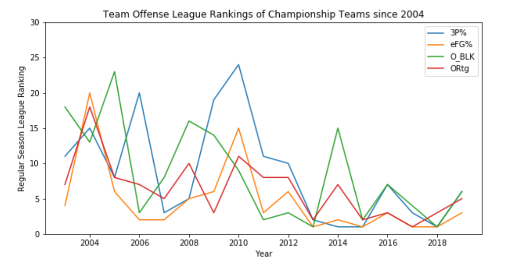
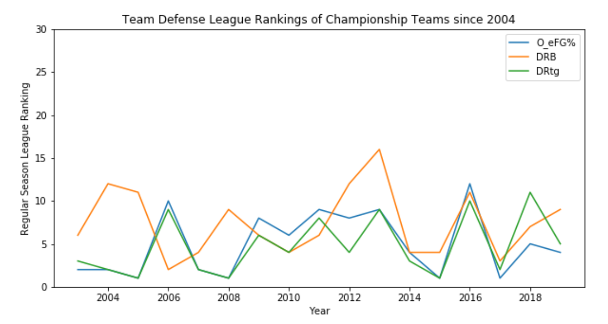
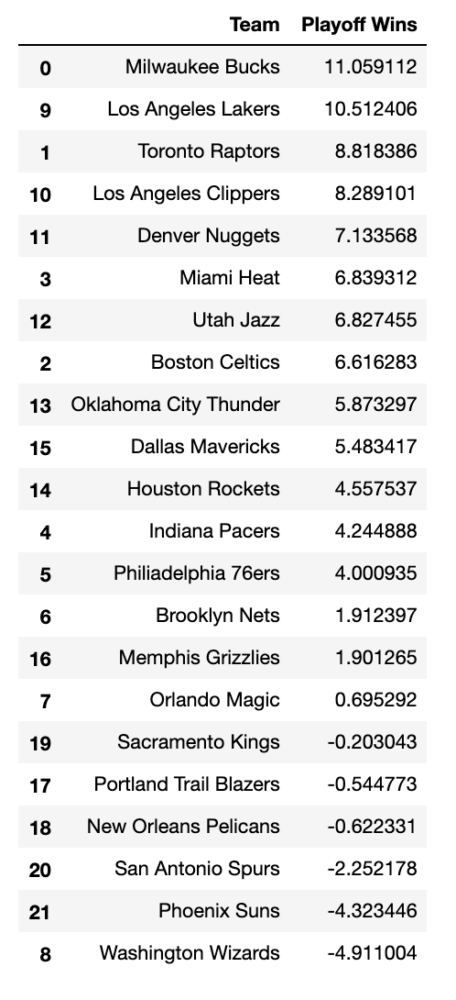

# 2020-NBA-Chip-Predictor
Predicting the 2020 NBA Champion using regular season league rankings before the start of the playoffs
## Overview
I have always loved debating basketball and the NBA. Many mornings I wake up and listen to Stephen A. Smith and Max Kellerman screaming at each other on ESPN First Take about which team will ultimately win the NBA Championship every year. Every April is especially fun when I would make bets with friends and family to support season-long arguements about who will win the title, right before the playoffs begin. This year, the playoffs didn't come in April, but after a long two months of suspension due to COVID-19, I was incredibly excited when the league announced the return of the season in July. Since the restart is still a couple weeks away,

### Goal: 
I wanted to create a machine learning project to predict this year's NBA Champion based solely off regular season team stats  and to understand which regular season league rankings are the most important to determine playoff success.

## Data Collection
I decided to scrape https://www.basketball-reference.com/leagues/ with Beautiful Soup for playoff teams' regular season team stat league rankings from the 2003-2004 to 2018-2019 seasons (ex. regular season field goal percentage, total rebounds per game, etc.). League rankings show a relative picture of each team's strengths and weaknesses compared to the rest of the league in a given season going into the playoffs. I did not include actual per game numbers since the nature of the game has changed so much throughout recent years as playstyle, strategies, pace, etc. have skewed numbers like points per game higher than in the past, and comparing the actual numbers across different seasons would give a less accurate representation of the importance of each category to the model.

League rankings are numbered 1-30 since there are 30 total teams: a league rank of 1 being the best, 30 being the worst. I did not scrape older seasons since the playoff structure was changed in 2004 so that an NBA Championship must consist of winning 4 best of 7 game series, whereas prior seasons did not. The web scraper file is separate from this notebook, and the resulting data was exported to the .csv files.

 
 
 

### Features for Models

 

* 3P%
* DRB
* O_BLK
* W
* SRS
* ORtg
* DRtg
* eFG%
* O_eFG%

Using league rankings from each of these categories to predict y, which is number of playoff games won.

## EDA
#### Opponent Blocks Per Game
I found the Opponent's Blocks (O_BLK) category to be the most interesting feature that is moderately correlated with playoff wins. This finding made me hypothesize that teams who rank in the top percentile in O_BLK give their opponents a more difficult time defending them, which equates to a greater win count. Additionally, the majority of blocks in basketball come from very short range shots, so teams whose opponents are less able to block shots are able to score much easier at a higher clip since there is a much higher probability of making a short range shot (ex. layup/dunk) vs a mid-range 2 or 3 pointer. I further explore the nature of O_BLK below.

 

### Championship Team Regular Season League Rankings over Time
Now I wanted to group each selected variable into 3 major regular season stat categories that are good indicators of predicting the NBA Champion before the playoffs begin: Offense, Defense, Nature of Wins. Below are the three line graphs that show how a championship team's different regular season league rankings have trended over time.
### Offense

 

There is more variability in the 2000s than the 2010s in terms of a champion's regular season team offensive stats. The most interesting trend here is the 3P% as the Golden State Warriors have revolutionized basketball with shooting 3's since 2014. The 3 pointer has become the most important shot in the game due to its higher EV and ability to space the floor to create more open 2 point field goals. We see that generally, champions of recent years tend to be ranked in the top 5-10 for each offensive team stat and are generally ranked top 5 in 3P%.

### Defense

 

Regular season team defense stat rankings seem to have much less variability than team offense stat rankings, and being ranked in the top 5-10 in these three categories can be a good indicator of a playoff champion. Defensive rebounding (DRB) is important, but slightly less important than limiting opponent field goal efficiency (O_eFG%) and overall defensive rating (DRtg).

### Nature of Wins

 

The amount of wins (W) and Simple Rating System (SRS) in the regular season seem to be the most consistent indicators of predicting a champion. It is rare for a championship team to rank outside the top 5 in number of regular season wins or SRS.

## Models
I used three models to compare across predictions:
### Linear Regression

 

### Random Forest

 

### XGBoost

 

## Conclusion
### Limitations
My main concern with the data is that the sample size of championship teams (16 playoff wins) is very small. This means that the best team in each model will always have an expected win count less than 16 which is obviously not sufficient to win the title. However, I interpreted the scores as a relative scale to see which team has the highest predicted value of wins as the champion.

The models' MAE also varied upon each resplitting of test and train data. The values generally ranged between 2 and 3 for each model. I used the predictions and MAE's from a random trial for the summary findings.

### Summary
Using regular season stat league rankings, I found that being in the top league rankings of amount of Wins (W) and Simple Rating System (SRS) during the regular season are the best indicators of predicting the champion. In recent trends, a higher offensive rating than defensive rating has translated into a greater chance of winning the title as well.

The best prediction performance was achieved by the Random Forest Regressor with a MAE of 2.65, and projected the Bucks as favorites for the title with 13 expected wins. XGBoost had a smaller Mean Absolute Error of 2.44, however it predicted that the 1st place Bucks would only win 9.3 games which is far off from the 16 needed for a championship.

The Milwaukee Bucks were chosen by each model to be the favorite to win the title. The Lakers, Raptors, and Clippers are usually mixed in the standings behind the Bucks.

### Future Work
I plan to keep updating this dataset each year's champion and continue to refine the existing models and add new ones. There is a lot of room for improvement in the algorithms, parameters, and statistics I used considering this is my  first data science project with only 2 months of coding experience.
